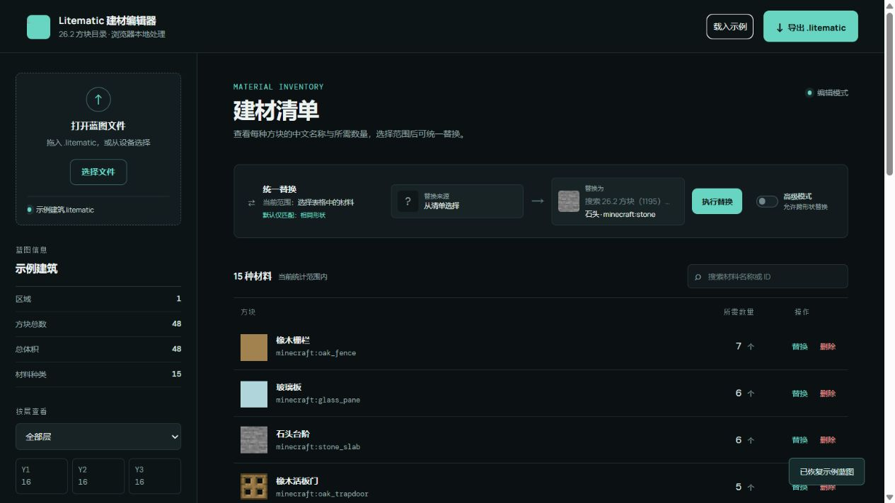
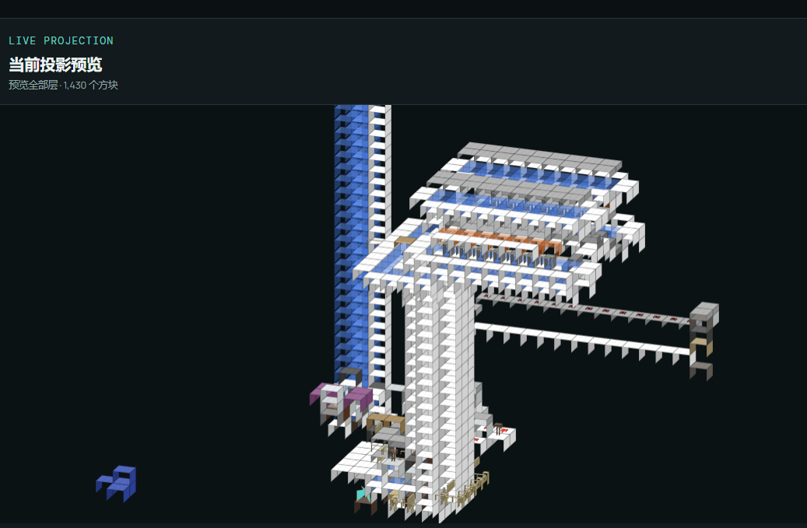

# Litematic 建材编辑器

一个面向 Minecraft 建筑蓝图的 `.litematic` 建材查看与统一替换工具。应用默认以空白状态启动，用户载入蓝图后才显示材料统计和投影预览。文件解析、替换和导出都在本机完成，不会上传蓝图内容。



## 下载使用

前往 [GitHub Releases](https://github.com/zxcplll/litematic-material-editor/releases/latest) 下载最新版：

- `Litematic-Editor-1.0.3-setup.exe`：Windows x64 安装版，可选择安装目录，并创建开始菜单和桌面快捷方式。
- `Litematic-Editor-1.0.3-portable.exe`：Windows x64 便携版，下载后直接运行，不需要安装 Node.js。
- `Litematic-Editor-1.0.3-README.txt`：离线中文使用说明。

## 使用方法

### 1. 打开蓝图

启动软件后，点击左侧的“选择文件”，或直接把 `.litematic` 文件拖入窗口。蓝图只在本机内存中解析，不会上传到服务器。

文件载入后，左侧会显示区域数量、方块总数、总体积和材料种类；中间会列出每种建材的中文名、Minecraft ID、图标和数量。首次打开软件时界面为空，需要演示数据可点击顶部“载入示例”。

### 2. 选择统计和修改范围

在左侧“按层查看”中选择：

- `全部层`：统计并修改整个蓝图。
- `第 N 层`：只查看和修改当前层，其他层保持不变。

切换层级后，建材数量和投影预览会同步更新。

### 3. 统一替换建材

1. 在建材清单中找到原方块，点击该行右侧的“替换”。
2. 在上方“替换为”搜索框输入中文名或 Minecraft ID。
3. 选择目标方块后点击“执行替换”。
4. 材料清单与投影预览会立即刷新。

普通模式只允许相同形状互换，例如半砖只能换成半砖、楼梯只能换成楼梯、玻璃板只能换成玻璃板。替换会尽量保留原方块的朝向、上下半砖、开合、连接和水浸等状态。

需要跨形状替换时可开启“高级模式”。软件会先显示风险提示，因为不同形状的占位和状态属性可能不兼容。

### 4. 删除建材

点击材料行右侧的“删除”，确认后会在当前选择范围内用空气替换该材料。删除前请检查左侧当前选择的是“全部层”还是指定层。

### 5. 查看投影预览



- 按住鼠标左键拖动：平移视角。
- 按住鼠标右键拖动：旋转视角。
- 滚动鼠标滚轮：缩放预览。
- 点击预览标题栏的 `−` / `＋`：逐级缩小或放大。
- 缩放范围为 `0.2x-12x`；大型工程放大后可继续左键平移查看局部。
- 点击“重置视角”：恢复默认角度、倍率和位置。

### 6. 导出修改后的蓝图

修改完成后点击右上角“导出 .litematic”，选择保存位置。导出的文件仍为标准 `.litematic` 格式，可继续在 Litematica 中加载；原始 NBT 结构会保留，材料统计元数据会随修改更新。

## 核心功能

- 读取压缩 NBT，统计全部层或指定层的非空气方块。
- 显示方块中文名、Minecraft ID、所需数量和物品图标；投影颜色由 26.2 原版 blockstate、模型和纹理自动生成，覆盖全部 1,195 个非空气方块。水、熔岩和红石线使用本地首帧/染色图标，不会把动画贴图压成细线或显示灰白遮罩。
- 使用 26.2 方块目录搜索替换目标，覆盖完整 blockstate ID 和中文语言表。
- 普通模式按几何类别限制替换：普通方块、半砖、楼梯、门、活板门、墙、栅栏、玻璃板、按钮、压力板、告示牌、地毯、铁轨等只能同类互换。
- 替换时保留源方块的 `Properties`，包括朝向、半砖上下、门/活板门开合、连接方式和水浸状态。
- 每种材料都可直接删除；确认后仅在当前选择的全部层或指定层中用无状态的空气替换该材料。
- 高级模式允许跨形状替换，开启前明确提示碰撞箱、占位范围和状态属性可能产生差异。
- 载入蓝图后提供实时投影预览：左键平移、右键旋转、滚轮缩放（0.2x-12x），也可使用预览区的 +/- 按钮，替换和按层筛选会立即重绘；放大后可配合左键平移查看大型工程局部。
- 预览会读取保存的方块状态，并在缺少连接状态时检查相邻坐标：玻璃板/染色玻璃板/铁栏杆/铜栏杆的孤立交叉与连接面、栅栏和墙的真实横杆、红石线/绊线/紫颂植物的分支、藤蔓/发光地衣/幽匿脉络/树脂团的附着面都会区分绘制；木架会显示未连接、左段、中段和右段，雕纹书架会显示 6 个槽位的占用状态；火焰按面附着状态显示，珊瑚墙扇按朝向贴墙显示，树叶堆/粉红花瓣/野花按数量显示。
- 导出仍为标准 `.litematic`，保留原始 NBT 节点并更新统计元数据。

## 开发启动

需要 Node.js 18 或更高版本：

```powershell
cd litematic-editor
npm install
npm test
npm run desktop
```

也可以使用静态服务器运行浏览器版：

```powershell
python -m http.server 4173
```

然后打开 <http://localhost:4173/>。

## 构建 Windows 发布包

```powershell
cd litematic-editor
npm install
npm run dist
```

`npm run dist` 会生成 x64 NSIS 安装版和便携版，输出到 `dist/`。窗口和 `.litematic` 文件关联使用 `assets/app-icon.ico`。

## 项目结构

| 路径 | 说明 |
| --- | --- |
| `index.html` / `styles.css` | 用户界面和样式 |
| `app.js` | 清单、替换规则、图标、投影预览和导出流程 |
| `nbt.js` | NBT 读写、GZIP 解压/压缩和 litematic 处理 |
| `blocks-26.2.js` | 26.2 blockstate 目录 |
| `block-names-26.2.js` | 中文方块语言表 |
| `block-colors-26.2.js` | 从 26.2 原版纹理生成的全量投影颜色表 |
| `assets/block-icons/` | 水、熔岩动画首帧和红石线运行时染色图标 |
| `tools/generate-block-colors.mjs` | 根据原版客户端资源重新生成颜色表 |
| `main.cjs` / `preload.cjs` | Electron 桌面壳和文件关联桥接 |
| `tests/` | NBT round-trip、替换属性、按层删除、形状和投影回归测试 |
| `发布包/` | 本地分发目录，Release 二进制作为 GitHub 附件发布 |

## 验证

```text
NBT_ROUNDTRIP PASS
REPLACEMENT_RULES PASS
PREVIEW_PROJECTION PASS
```

项目使用 MIT License，详见 `LICENSE`。
